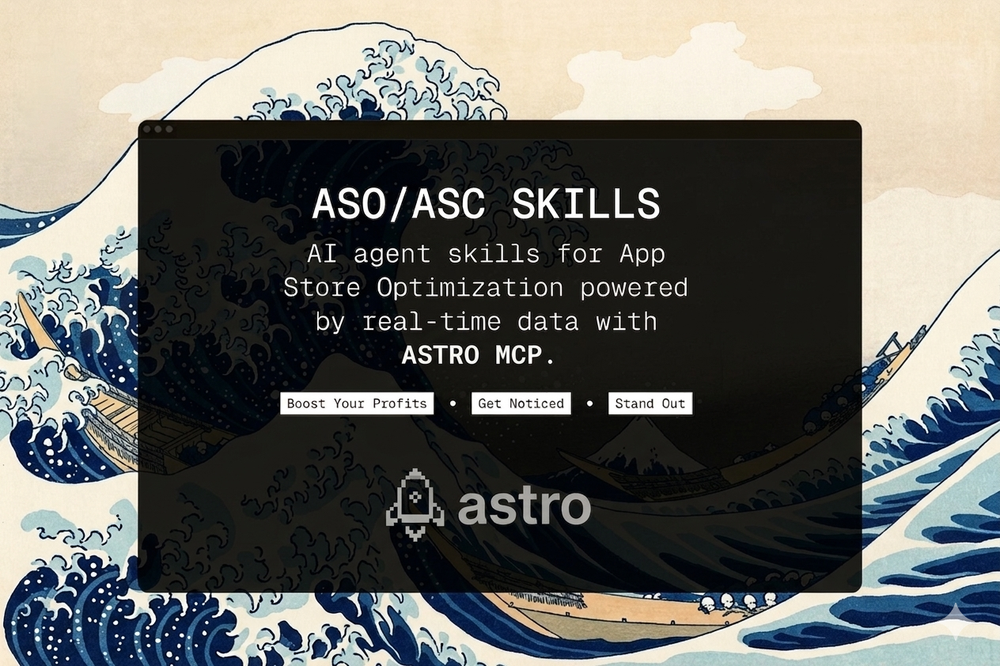

# ASO & App Marketing Skills



<div align="center">
<p align="center">
  <a href="https://www.linkedin.com/in/erencanarica/">
    
  </a>
  </p>
</div>

AI agent skills for App Store Optimization (ASO) and mobile app marketing. Built for indie developers, app marketers, and growth teams who want **Cursor**, **Claude Code**, or any [Agent Skills](https://agentskills.io)-compatible AI assistant to help with keyword research, metadata optimization, competitor analysis, and app growth.

Powered by real App Store data via a small, composable stack: the **[Astro](https://tryastro.app?aff=z0Jlp)** MCP (keywords, rankings, ratings), **Sensor Tower**'s public endpoint (metadata, screenshots, downloads / revenue estimates), **iTunes Lookup** (release notes), and a **web scrape of `apps.apple.com`** for user reviews.

## Why This Exists

Most ASO knowledge lives in blog posts, courses, and expensive consultants. We packaged it into skills that any AI agent can use — so you get expert-level ASO guidance directly in your IDE.

Each skill contains battle-tested frameworks, scoring rubrics, and output templates. The agent reads the skill, pulls real data from the App Store (via the Astro MCP, Sensor Tower's public endpoint, iTunes Lookup, and a scrape of `apps.apple.com`) and gives you actionable recommendations — not generic advice.

## Quick Start

### 1. Install Astro

[**Download Astro**](https://tryastro.app?aff=z0Jlp) — macOS app that tracks your App Store keywords, rankings, and ratings, and exposes an MCP server for AI agents to consume that data.

Once installed, open Astro → **Settings** → enable the **MCP server**. It listens locally on `http://127.0.0.1:8089/mcp` (no auth, localhost-only).

### 2. Wire the MCP server into your agent

**Claude Code:**
```bash
claude mcp add --transport http astro http://127.0.0.1:8089/mcp
```

**Cursor** — edit `~/.cursor/mcp.json`:
```json
{
  "mcpServers": {
    "astro": {
      "url": "http://127.0.0.1:8089/mcp"
    }
  }
}
```

**VS Code** — edit `~/.vscode/mcp.json` or `.vscode/mcp.json`:
```json
{
  "servers": {
    "astro": {
      "type": "http",
      "url": "http://127.0.0.1:8089/mcp"
    }
  }
}
```

### 3. Install the skills

**Cursor** — Settings (Cmd+Shift+J) → Rules → Add Rule → Remote Rule (Github) → paste `https://github.com/nbapps/aso-skills`

**Claude Code** — `npx skills add nbapps/aso-skills`

**Manual** — `git clone https://github.com/nbapps/aso-skills.git && cp -r aso-skills/skills/* .cursor/skills/`

Then ask your agent:

```
"Run an ASO audit for my app (id: 1617391485)"
"Find the best keywords for a meditation app"
"Optimize my App Store title and subtitle"
"Set up a weekly competitor monitoring routine for apps X, Y, Z"
"My app rating dropped — how do I recover it?"
"Build an Apple Search Ads campaign structure for my fitness app"
"Help me plan a Christmas In-App Event"
"What seasonal keywords should I add in December?"
"Optimize my Google Play listing"
"Help me pitch TechCrunch for my app launch"
"My app has a crash affecting 2% of sessions — help me triage it"
```

Or invoke directly: `/aso-audit`, `/keyword-research`, `/metadata-optimization`, `/asc-metrics`, `/in-app-events`, `/seasonal-aso`, `/android-aso`, `/apple-search-ads`, `/competitor-tracking`

## Skills

### ASO Core

| Skill | What it does |
|-------|-------------|
| [`aso-audit`](skills/aso-audit) | Scores your listing across 10 factors (0-100), flags problems, gives a prioritized fix list |
| [`keyword-research`](skills/keyword-research) | Finds keywords by volume × difficulty × relevance, groups them into primary/secondary/long-tail |
| [`metadata-optimization`](skills/metadata-optimization) | Writes title, subtitle, keyword field, description — with 3 variants and character counts |
| [`competitor-analysis`](skills/competitor-analysis) | Keyword gaps, creative teardown, positioning map, and specific opportunities to exploit |
| [`seasonal-aso`](skills/seasonal-aso) | Seasonal keyword calendar, metadata swap strategy, timing checklist, and trending-moment tactics |
| [`android-aso`](skills/android-aso) | Google Play-specific ASO — indexed description strategy, short description, Play Experiments, rating recovery |

### Creative & International

| Skill | What it does |
|-------|-------------|
| [`screenshot-optimization`](skills/screenshot-optimization) | 10-slot screenshot strategy with design briefs, text overlay copy, and competitor audit |
| [`app-icon-optimization`](skills/app-icon-optimization) | Icon design principles, A/B testing via PPO/Play Experiments, category differentiation, and icon briefs |
| [`review-management`](skills/review-management) | Sentiment analysis, response templates (HEAR framework), rating improvement tactics |
| [`localization`](skills/localization) | Market prioritization matrix, per-country keyword research, cultural adaptation checklist |

### Growth

| Skill | What it does |
|-------|-------------|
| [`app-launch`](skills/app-launch) | 8-week launch timeline with daily checklists, channel strategy, and press outreach templates |
| [`ua-campaign`](skills/ua-campaign) | Apple Search Ads, Meta, Google UAC — campaign structure, bidding, creative specs, budget allocation |
| [`apple-search-ads`](skills/apple-search-ads) | Deep-dive ASA — campaign structure, match types, CPP routing, bid strategy, weekly optimization checklist |
| [`app-store-featured`](skills/app-store-featured) | Featuring readiness score, Apple tech checklist, pitch template, In-App Events calendar |
| [`in-app-events`](skills/in-app-events) | Plan and write App Store In-App Events — copy, image brief, keyword strategy, submission timeline |
| [`app-clips`](skills/app-clips) | App Clip use cases, card design, URL scheme setup, SKOverlay handoff, and measurement |
| [`press-and-pr`](skills/press-and-pr) | Media targeting tiers, pitch templates, press kit checklist, embargo strategy, Product Hunt launch |

### Revenue & Retention

| Skill | What it does |
|-------|-------------|
| [`monetization-strategy`](skills/monetization-strategy) | Pricing tiers, paywall timing/design, trial optimization, category benchmarks |
| [`subscription-lifecycle`](skills/subscription-lifecycle) | Trial nurture sequences, voluntary/involuntary churn reduction, dunning, and win-back campaigns |
| [`retention-optimization`](skills/retention-optimization) | Activation → habit → engagement framework, push notification sequences, churn prevention |
| [`onboarding-optimization`](skills/onboarding-optimization) | First-run flow audit, activation event definition, permission prompt timing, sign-up friction reduction |
| [`rating-prompt-strategy`](skills/rating-prompt-strategy) | SKStoreReviewRequest / Play In-App Review timing, pre-prompt survey, version-gating, and rating recovery |

### Analytics & Testing

| Skill | What it does |
|-------|-------------|
| [`app-analytics`](skills/app-analytics) | Event tracking plan, dashboard setup, KPI framework with category benchmarks |
| [`ab-test-store-listing`](skills/ab-test-store-listing) | Hypothesis → variant design → sample size → interpretation for App Store A/B tests |
| [`asc-metrics`](skills/asc-metrics) | Analyze your exact App Store Connect data (downloads, revenue, subscriptions, countries) via the official ASC API |
| [`crash-analytics`](skills/crash-analytics) | Crashlytics setup, crash triage framework (P0–P3), symbolication, phased release strategy, rating recovery |

### Market Intelligence *(degraded)*

These skills still load and run, but have no live data source in the current stack — they degrade to general-knowledge output. See [tools/REGISTRY.md](tools/REGISTRY.md).

| Skill | What it does |
|-------|-------------|
| [`market-movers`](skills/market-movers) | Top chart gainers/losers, new entries, and dropped apps |
| [`market-pulse`](skills/market-pulse) | Full market briefing: chart movements + trending keywords + featured apps + new launches |
| [`competitor-tracking`](skills/competitor-tracking) | Weekly competitor surveillance — metadata changes, keyword shifts, rating trends (live, non-degraded) |

### Foundation

| Skill | What it does |
|-------|-------------|
| [`app-marketing-context`](skills/app-marketing-context) | Creates a context doc (app, audience, competitors, goals) that all other skills reference |

## How It Works

```
You: "Run an ASO audit for Headspace"

Agent:
  1. Reads aso-audit/SKILL.md (framework, scoring rubric, output template)
  2. Pulls metadata from Sensor Tower, release notes from iTunes Lookup,
     keywords + ratings from the Astro MCP, reviews from the apps.apple.com scrape
  3. Scores each factor (title: 8/10, subtitle: 6/10, keywords: 4/10...)
  4. Returns: ASO Score Card + Quick Wins + High-Impact Changes + Strategic Recs
```

Skills reference each other — `aso-audit` might suggest running `keyword-research` for deeper analysis, which then feeds into `metadata-optimization` for implementation.

## Installation Reference

### Cursor

| Method | Command |
|--------|---------|
| GitHub Import | Settings → Rules → Add Rule → Remote Rule → `https://github.com/nbapps/aso-skills` |
| Project-level | `cp -r aso-skills/skills/* .cursor/skills/` |
| Global | `cp -r aso-skills/skills/* ~/.cursor/skills/` |

### Claude Code

| Method | Command |
|--------|---------|
| CLI | `npx skills add nbapps/aso-skills` |
| Specific skills | `npx skills add nbapps/aso-skills --skill aso-audit keyword-research` |
| Manual | `cp -r aso-skills/skills/* .claude/skills/` |

### Any Agent

```bash
git submodule add https://github.com/nbapps/aso-skills.git .agents/aso-skills
```

Works with any tool that supports the [Agent Skills](https://agentskills.io) standard (`.agents/skills/`, `.cursor/skills/`, `.claude/skills/`, `.codex/skills/`).

## Data Stack

Skills work standalone with general ASO knowledge. For real-time data they compose four sources:

| Source | Role | Auth |
|--------|------|------|
| **[Astro MCP](tools/integrations/astro.md)** | Keyword tracking, rankings (+ history + volatility + trend), ratings (+ history), App Store search, AI keyword suggestions, competitor keyword extraction | None (localhost-only) |
| **[Sensor Tower public](tools/integrations/sensor-tower.md)** | App metadata (title, subtitle, description, promo text, categories, languages), screenshots, icon, monthly downloads & revenue estimates | None |
| **[iTunes Lookup](tools/integrations/itunes-lookup.md)** | Release notes / What's New, per-country metadata, supported languages, file size, minimum OS | None |
| **[App Store reviews scrape](tools/integrations/apple-reviews-scrape.md)** | ~40 SSR-rendered reviews per country per request (Apple's public RSS feed is effectively deprecated) | None |

### First-Party ASC Data — `asc-metrics`

The `asc-metrics` skill pulls directly from the **official [App Store Connect API](tools/integrations/app-store-connect.md)** — exact downloads, revenue, subscriptions, trials, and country breakdowns from Sales & Finance reports. Requires an ASC API key with the **Sales and Finance** role (JWT auth).

```
"How are my downloads trending this month?"
"What are my top 5 markets by revenue?"
"Compare this month's subscriptions to last month"
```

### Not Covered

Market-wide intelligence (chart rankings by country, market movers, trending keywords, featured apps, new releases) is **not covered** by the current stack. Affected skills (`market-movers`, `market-pulse`, `app-store-featured`) degrade to general-knowledge output. See [tools/REGISTRY.md](tools/REGISTRY.md) for the full capability matrix.

## Contributing

PRs welcome — fix an inaccuracy, improve a framework, or add a new skill. See [CONTRIBUTING.md](CONTRIBUTING.md).

## License

MIT
